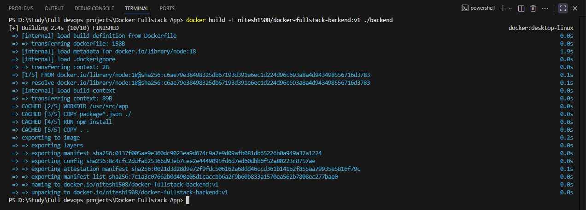
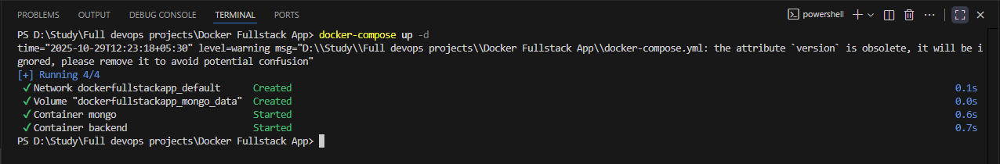
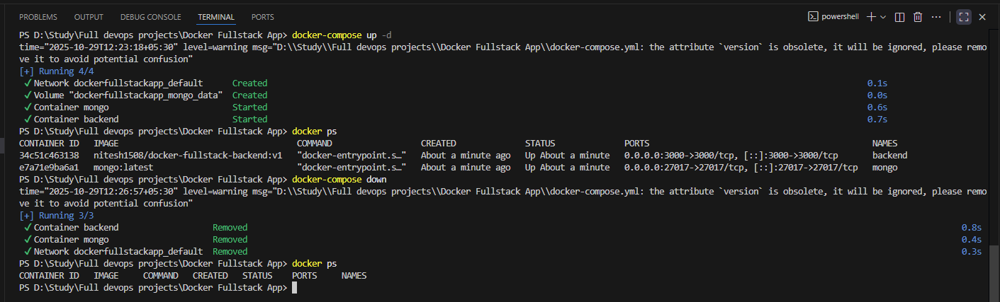

# 🚀 Dockerized Full-Stack Application

This repository hosts a Proof of Concept (PoC) demonstrating how to fully **dockerize** and orchestrate a multi-service application. It showcases the integration of a **Node.js/Express backend**, a **frontend**, and a **MongoDB database** using **Docker Compose**.

## 📁 Project Structure

The project is structured into three main directories: `backend`, `frontend`, and the root configuration file `docker-compose.yml`.

## 🏗️ Technologies Used

| **Component** | **Technology** | **Description** | 
| ----- | ----- | ----- | 
| **Backend** | Node.js (Express) | Serves the API and handles application logic. | 
| **Database** | MongoDB | Persistent storage for application data. | 
| **Frontend** | React/Simple HTML | The client-side application served on port 3000. | 
| **Orchestration** | Docker & Docker Compose | Containerization and multi-container management. | 

---

## ⚙️ Prerequisites

* **Docker**
* **Docker Compose**
* **Docker Hub Account** (Required for pushing custom images)

---

## 🐳 Docker Image Management (Backend)

The backend service uses a custom image built from its `Dockerfile`. These steps illustrate how to build and push this custom image to Docker Hub, making it accessible for the `docker-compose.yml`.

### 1. Build and Tag the Image

Run the build command from the root directory, tagging the image with your Docker Hub username (`nitesh1500`) and a version.

**Output of Successful Build**

### 2. Docker Login

You must log in to your Docker Hub account using your username and a Personal Access Token (PAT).

**Login Success**

### 3. Push the Image to Docker Hub

This makes your custom backend image available for others (or CI/CD pipelines) to pull.

**Output of Successful Push**

---

## 🚀 Running the Application with Docker Compose

With the custom images prepared (or pulled), you can launch the full environment with a single command.

### 1. Start All Services

Run the following command from the root directory. The `-d` flag runs the containers in **detached mode**.

**Services Started**

### 2. Verify Running Containers

Check the status of all services to ensure they are running and their ports are mapped correctly.

**Running Containers Status**

### 3. Access the Application

Open your web browser and navigate to the exposed frontend port:

* **Frontend URL:** `http://localhost:3000`

**Application Output**

---

## 🛑 Stopping and Cleanup

To stop and remove all running containers, along with the created network and volumes:

**Cleanup Output**
